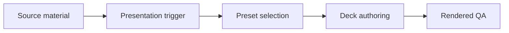

# Academic Presentation Skill

Portable presentation-authoring skill for turning papers, posters, and review materials into final academic decks for Codex App and Claude CLI.

## Who This Is For

| Use this when you... | Use something else when you... |
| --- | --- |
| turn papers, posters, or prepared review content into presentation decks | need low-level PowerPoint XML repair only |
| need deterministic presets for seminar, conference, defense, or review-deck workflows | need a full literature review before any deck content exists |
| want public references plus a Claude CLI excerpt in one package | only want to explain one slide or paragraph |

## Why This Exists

- Separates upstream review synthesis from final deck authoring.
- Keeps repeatable presentation presets close to the skill package.
- Makes visual QA expectations explicit for generated decks.

## What Ships

| Component | Role |
| --- | --- |
| [`academic-presentation`](./academic-presentation) | installable Codex App skill package |
| [`academic-presentation/agents/openai.yaml`](./academic-presentation/agents/openai.yaml) | Codex App interface metadata |
| [`academic-presentation/references`](./academic-presentation/references) | bundled public reference material |
| [`academic-presentation/test-prompts.json`](./academic-presentation/test-prompts.json) | trigger and non-trigger examples |
| [`claude-code-cli/CLAUDE.academic-presentation.md`](./claude-code-cli/CLAUDE.academic-presentation.md) | copyable Claude CLI excerpt |
| [`CHANGELOG.md`](./CHANGELOG.md) | release history |
| [`LICENSE`](./LICENSE) | license |

## Install / Use

### Codex App

- Install the skill from this repo path: `academic-presentation`
- GitHub install target:
  - repo: `Mingdao007/academic-presentation-skill`
  - path: `academic-presentation`
- Restart `Codex App` after installation so the new skill is discovered.

## Workflow

## Coverage

- conference, seminar, defense, and review-deck routing
- deterministic preset selection between oral-talk and literature-review decks
- paper-first presentation workflow with reusable public references
- rendered-deck visual QA and report-class source-text scan guidance

## Expected Result / Verification

| Check | Expected result |
| --- | --- |
| Install target | `academic-presentation` |
| GitHub target | `Mingdao007/academic-presentation-skill` with path `academic-presentation` |
| Skill entrypoint | `academic-presentation/SKILL.md` exists |
| Trigger examples | `academic-presentation/test-prompts.json` |
| Privacy check | public package contains no private local paths or live user state |

## Trigger Examples

- `Make a literature-review deck from these papers.`
- `Turn this poster into a short talk deck.`
- `Prepare a seminar presentation from this paper.`

## Non-Trigger Examples

- `Edit one existing .pptx template at the XML level.`
- `Do a full literature review from scratch.`
- `Only explain one slide or one paragraph.`

## Privacy Boundary

This public repository keeps the workflow generic and reusable.

- Examples stay generic and omit private project, course, or advisor context.
- This package publishes no local absolute paths, private workspace references, or host-specific private skill links.

## Repository Layout

| Path | Purpose |
| --- | --- |
| [`academic-presentation`](./academic-presentation) | installable Codex App skill package |
| [`academic-presentation/agents/openai.yaml`](./academic-presentation/agents/openai.yaml) | Codex App interface metadata |
| [`academic-presentation/references`](./academic-presentation/references) | bundled public reference material |
| [`academic-presentation/test-prompts.json`](./academic-presentation/test-prompts.json) | trigger and non-trigger examples |
| [`claude-code-cli/CLAUDE.academic-presentation.md`](./claude-code-cli/CLAUDE.academic-presentation.md) | copyable Claude CLI excerpt |
| [`CHANGELOG.md`](./CHANGELOG.md) | release history |
| [`LICENSE`](./LICENSE) | license |

Chinese:

- [README.zh-CN.md](./README.zh-CN.md)
